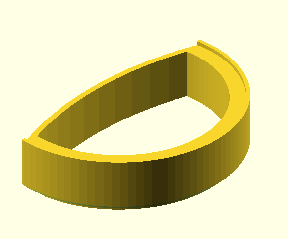
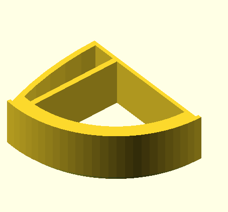
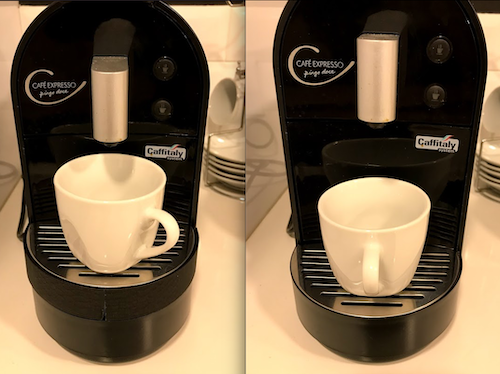

# coffee machine cup support

This support ([support.scad](support.scad)) holds coffee cups higher to reduce spilling (for [Pingo Doce Caffitaly machine](https://www.pingodoce.pt/receitas/tecnicas/como-descalcificar-a-maquina-de-cafe-pingo-doce/))

There's version to print it in two parts as my printing bed is really small.

[support_test](support_test.scad) was an experiment but never finished/tested.

