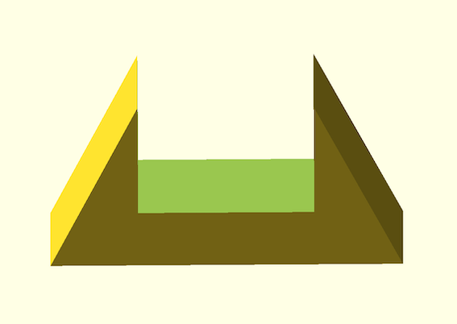
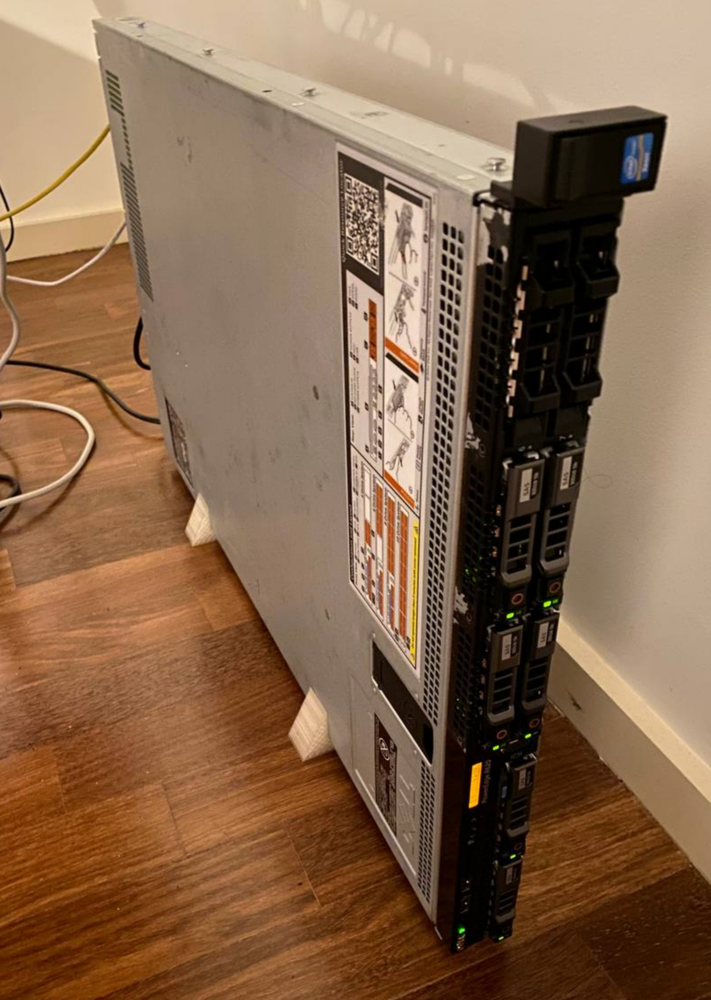

# rack stand

A vertical stand ("tower kit") for Dell R620 that should also fit any 1U servers.

Measurements were all taken from the server (not specs) but everything is easily changed in the SCAD variables (such as using with a 2U server).

*Note*:
* I'd like to have a wider support but my print bed is small (12cm diameter/circular). If anyone uses this and increases it, let me know how it goes

